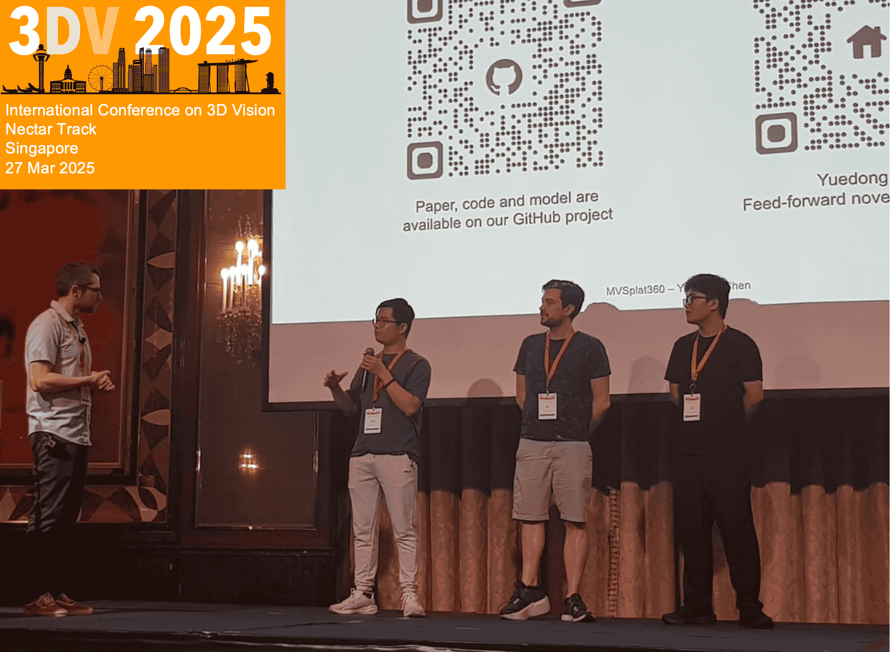
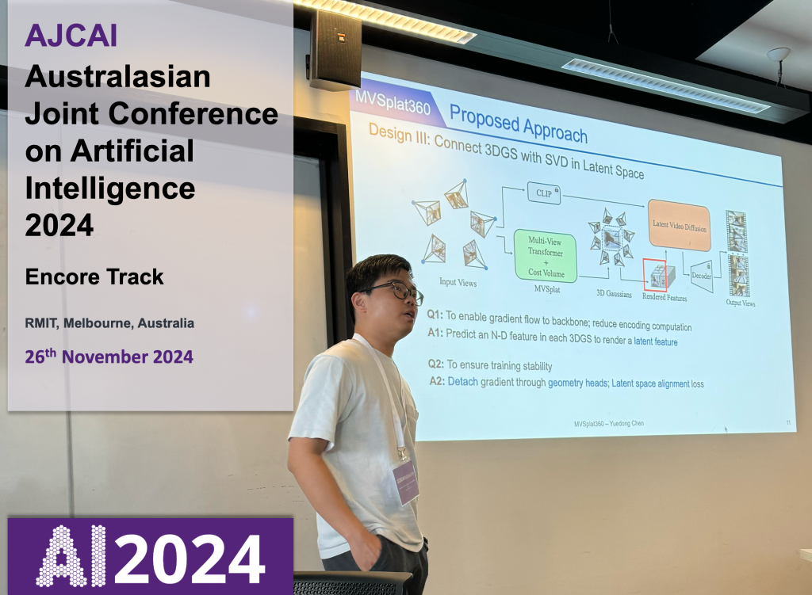
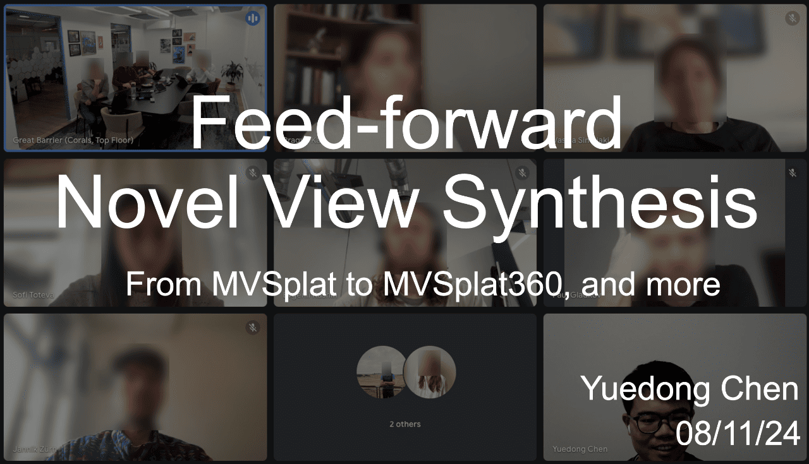
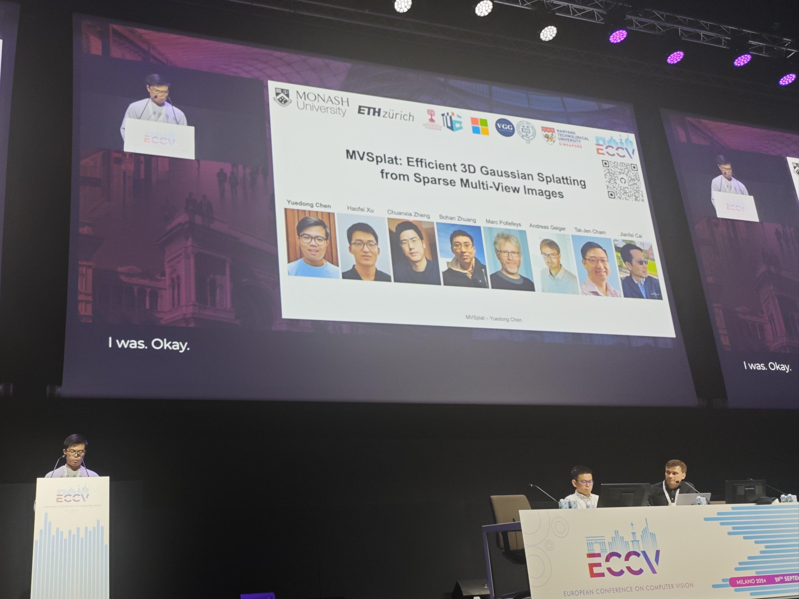
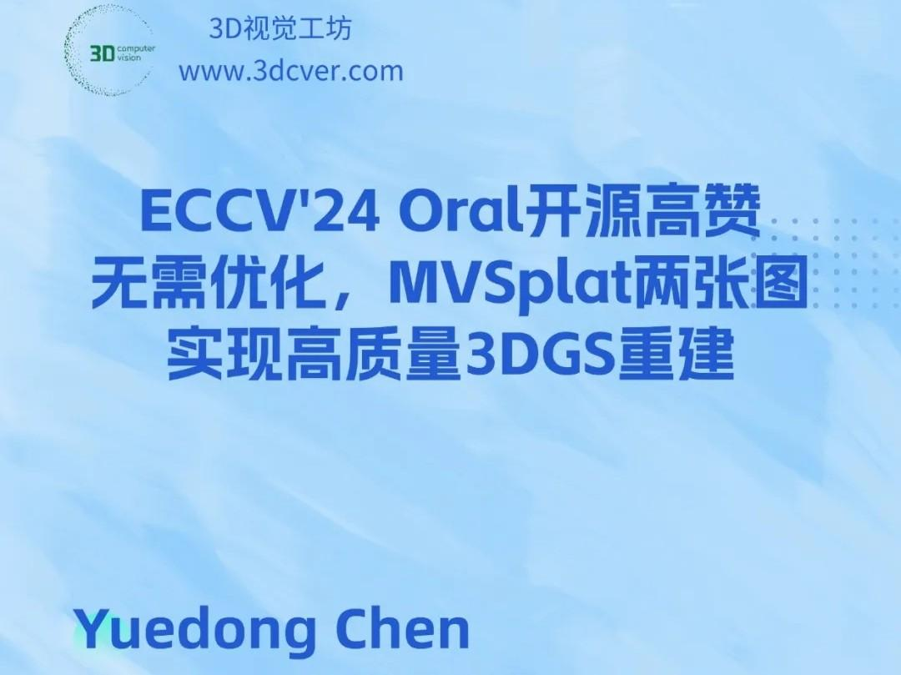
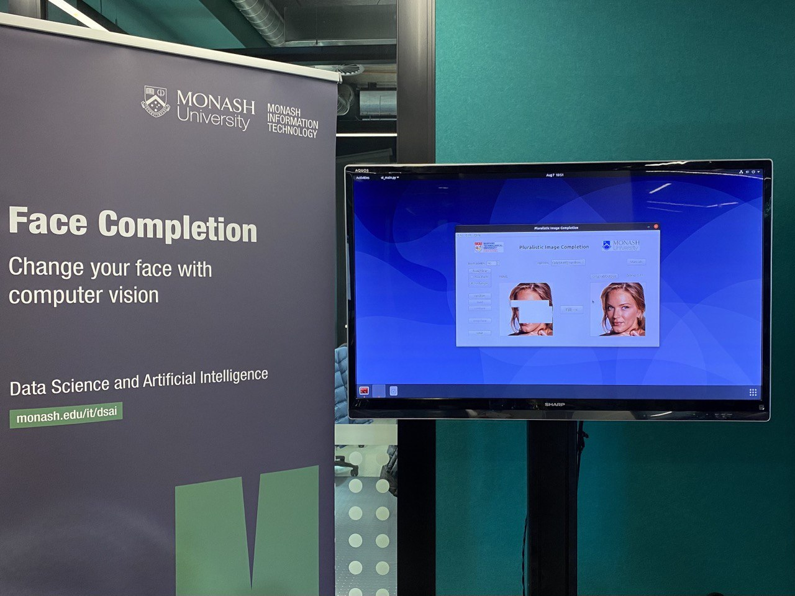
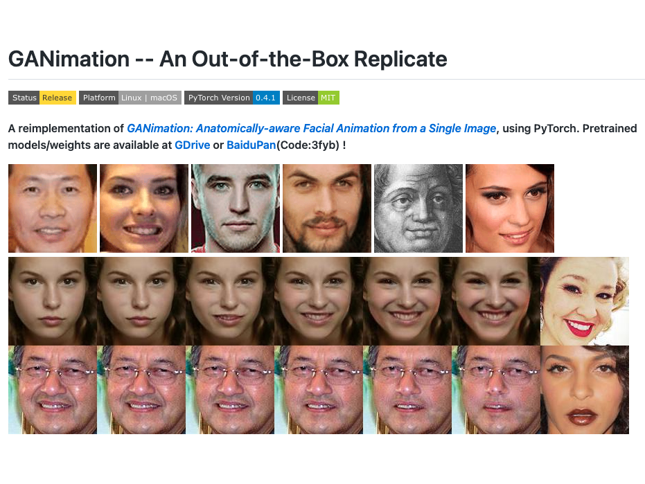

<h2 class="h1 index-header" id="about">Short Bio </h2>

Donny (Yuedong) Chen is currently a Research Scientist at [ByteDance Seed (Singapore)](https://seed.bytedance.com/en/), where he is building 3D & 4D foundation models. ALL VIEWS ARE HIS OWN ([DISCLAIMER](/#disclaimer)).

Before this, Donny obtained his PhD degree at [Monash University](https://www.monash.edu), under the supervision of Prof. [Jianfei Cai](https://jianfei-cai.github.io), Prof. [Tat-Jen Cham](https://personal.ntu.edu.sg/astjcham/) and Dr. [Bohan Zhuang](https://bohanzhuang.github.io/). His PhD research focused on [Feed-Forward Novel View Synthesis from Sparse Observations](https://bridges.monash.edu/articles/thesis/Feed-Forward_Novel_View_Synthesis_from_Sparse_Observations/29123996). During his PhD, he was fortunate to collaborate closely with [Haofei Xu](https://haofeixu.github.io/), Prof. [Marc Pollefeys](https://people.inf.ethz.ch/marc.pollefeys/), Prof. [Andreas Geiger](http://www.cvlibs.net/), Dr. [Chuanxia Zheng](https://physicalvision.github.io/people/~chuanxia), Prof. [Andrea Vedaldi](https://www.robots.ox.ac.uk/~vedaldi/) and Dr. [Qianyi Wu](https://wuqianyi.top/).

Previously, he was a Research Assistant at [IMI NTU (Singapore)](http://web.archive.org/web/20200812205019/https://imi.ntu.edu.sg/Pages/Home.aspx), where he worked closely with Prof. [Tat-Jen Cham](https://personal.ntu.edu.sg/astjcham/) and Prof. [Jianfei Cai](https://jianfei-cai.github.io). During this period, his research focused on enhancing emotion recognition by incorporating human prior knowledge. 
<!-- He also interned at [Lenovo Research](https://research.lenovo.com/webapp/view_English/researchField.html), collaborating closely with Dr. [Jianfeng Wang](https://jianf-wang.github.io/personal/). -->

His academic journey began with the completion of both his MEng and BEng degrees at [Sun Yat-sen University](https://www.sysu.edu.cn/sysuen/), where he majored in Software Engineering. Additionally, he spent a semester as an exchange student at [National Chi Nan University (Taiwan)](https://www.ncnu.edu.tw/?Lang=en) during his BEng study, collaborating closely with [David Cheng](https://www.linkedin.com/in/hui-sheng-cheng/).

  
<!-- Put time-sensitive news below -->

<a class="external" href="https://github.com/DepthAnything" target="_blank">Our team</a> has openings for both full-time and internship positions from time to time. If you are interested in conducting 3D/4D vision research with us, please feel free to reach out to me via my <a href="mailto:donny.chen@bytedance.com">company email</a>.

<!-- Actively seeking Research Scientist position (<a href="mailto:donny.chen@outlook.sg">Email</a>, <a href="assets/pdf/Resume_Yuedong_CHEN.pdf">CV</a>)     -->
<!-- I will present MVSplat360 on-site at NeurIPS24 (13/12 at Vancouver). Let's connect! -->

  <ul>
    <li> <a href="mailto:donny.chen@outlook.sg" title="donny.chen@outlook.sg" class="no-mark-external" target="_blank">  Email Donny's Email Address</a></li>
    <li> <a href="https://scholar.google.com/citations?user=GqgGZlQAAAAJ" title="Google Scholar" class="no-mark-external" target="_blank">  Google Scholar Donny's Google Scholar profile</a></li>
    <li> <a href="https://github.com/donydchen" title="GitHub" class="no-mark-external" target="_blank">  GitHub Donny's Github</a></li>
    <li> <a href="https://www.linkedin.com/in/donydchen" title="LinkedIn" class="no-mark-external" target="_blank">  LinkedIn Donny's LinkedIn</a></li>
    <li> <a href="https://bsky.app/profile/donydchen.bsky.social" title="Bluesky" class="no-mark-external" target="_blank">  Bluesky Donny's Bluesky</a></li>
    <li> <a href="https://x.com/donydchen" title="X" class="no-mark-external" target="_blank">  X Donny's X</a></li>
  </ul>

---

<h2 class="h1 index-header" id="publications">Selected Publications </h2>

 🤖🧠👌🏼 He prefers simple yet effective solutions 

 * indicates Equal Contribution 

  
Depth Anything 3: Recovering the Visual Space from Any Views

  
Tech Report 2025

  
Haotong Lin*, Sili Chen*, Jun Hao Liew*, <b>Donny Y. Chen*</b>, Zhenyu Li, Guang Shi, Jiashi Feng, Bingyi Kang*

  
[<a href="https://arxiv.org/abs/2511.10647">arXiv</a>] [<a href="https://github.com/ByteDance-Seed/depth-anything-3">code</a>] [<a href="https://depth-anything-3.github.io/">project
    page</a>] [<a href="https://huggingface.co/spaces/depth-anything/depth-anything-3">demo</a>] [<a href="https://depth-anything-3.github.io/gallery.html">gallery</a>]

<!-- 

  
Revisiting Depth Representations for Feed-Forward 3D Gaussian Splatting

  
3DV 2026

  
Duochao Shi*, Weijie Wang*, <b>Donny Y. Chen</b>, Zeyu Zhang, Jia-Wang Bian, and Bohan Zhuang

  
[<a href="https://arxiv.org/abs/2506.05327">arXiv</a>] [<a href="https://github.com/aim-uofa/PM-Loss">code</a>] [<a href="https://aim-uofa.github.io/PMLoss/">project
    page</a>] 

  
ZPressor: Bottleneck-Aware Compression for Scalable Feed-Forward 3DGS

  
NeurIPS 2025

  
Weijie Wang, <b>Donny Y. Chen</b>, Zeyu Zhang, Duochao Shi, Akide Liu, and Bohan Zhuang

  
[<a href="https://arxiv.org/abs/2505.23734">arXiv</a>] [<a href="https://github.com/ziplab/ZPressor">code</a>] [<a href="https://lhmd.top/zpressor/">project
    page</a>] 

 -->

  
Explicit Correspondence Matching for Generalizable Neural Radiance Fields

  
TPAMI 2025

  
<b>Yuedong Chen</b>, Haofei Xu, Qianyi Wu, Chuanxia Zheng, Tat-Jen Cham, and Jianfei Cai

  
[<a href="http://arxiv.org/abs/2304.12294">arXiv</a>] [<a href="https://github.com/donydchen/matchnerf">code</a>] [<a href="https://donydchen.github.io/matchnerf/">project
    page</a>] 

  
MVSplat360: Feed‑Forward 360 Scene Synthesis from Sparse Views

  
NeurIPS 2024

  
<b>Yuedong Chen</b>, Chuanxia Zheng, Haofei Xu, Bohan Zhuang, Andrea Vedaldi, Tat‑Jen Cham, and Jianfei Cai

  
[<a href="https://arxiv.org/abs/2411.04924">arXiv</a>] [<a href="https://github.com/donydchen/mvsplat360">code</a>] [<a href="https://donydchen.github.io/mvsplat360">project page</a>] [also presented at <a href="https://ajcai2024.org/call_for_encore.html">AJCAI'24</a> & <a href="https://3dvconf.github.io/2025/call-for-nectar-track/">3DV'25</a>]

  <!-- 
 TL;DR: MVSplat360 is a feed‑forward model that combines 3DGS with SVD to achieve 360° NVS for complex scenes with less than 5 input views. 
  -->

  
MVSplat: Efficient 3D Gaussian Splatting from Sparse Multi-View Images

  
ECCV 2024 (Oral)

  
<b>Yuedong Chen</b>, Haofei Xu, Chuanxia Zheng, Bohan Zhuang, Marc Pollefeys, Andreas Geiger, Tat-Jen Cham, and Jianfei Cai

  
[<a href="https://arxiv.org/abs/2403.14627">arXiv</a>] [<a href="https://github.com/donydchen/mvsplat">code</a>] [<a href="https://donydchen.github.io/mvsplat">project
    page</a>] [<a href="https://news.ycombinator.com/item?id=41222655">Hacker News</a>] [<a href="https://trendshift.io/repositories/8862" class="hl-work">Trendshift #20</a>] [<a href="https://resources.paperdigest.org/2025/09/most-influential-eccv-papers-2025-09-version/" class="hl-work">Most Influential ECCV Paper #13</a>] 

  
MuRF: Multi-Baseline Radiance Fields

  
CVPR 2024

  
Haofei Xu, Anpei Chen, <b>Yuedong Chen</b>, Christos Sakaridis, Yulun Zhang, Marc Pollefeys, Andreas Geiger, <i>et al.</i>

  
[<a href="https://arxiv.org/abs/2312.04565">arXiv</a>] [<a href="https://github.com/autonomousvision/murf">code</a>] [<a href="https://haofeixu.github.io/murf/">project
    page</a>] 

  
Sem2NeRF: Converting Single-View Semantic Masks to Neural Radiance Fields

  
ECCV 2022

  
<b>Yuedong Chen</b>, Qianyi Wu, Chuanxia Zheng, Tat-Jen Cham, and Jianfei Cai

  
[<a href="https://arxiv.org/abs/2203.10821">arXiv</a>] [<a href="https://github.com/donydchen/sem2nerf">code</a>] [<a href="https://donydchen.github.io/sem2nerf/">project
    page</a>] [<a href="https://www.youtube.com/watch?v=cYr3Dz8N_9E">demo video</a>] 

  
Object-Compositional Neural Implicit Surfaces

  
ECCV 2022

  
Qianyi Wu, Xian Liu, <b>Yuedong Chen</b>, Kejie Li, Chuanxia Zheng, Jianfei Cai, and Jianmin Zheng

  
[<a href="https://arxiv.org/abs/2207.09686">arXiv</a>] [<a href="https://github.com/QianyiWu/objsdf">code</a>]
    [<a href="https://wuqianyi.top/objectsdf/">project
      page</a>] [<a href="https://youtu.be/23vxOV19bEw">demo video</a>] 

<!-- 

  
Towards Unbiased Visual Emotion Recognition via Causal Intervention

  
ACM Multimedia 2022

  
Yuedong Chen, Xu Yang, Tat-Jen Cham, and Jianfei Cai

  
[<a href="https://arxiv.org/abs/2107.12096">arXiv</a>] [<a href="https://github.com/donydchen/causal_emotion">code</a>]
  

 -->

<!-- 

  
GeoConv: Geodesic Guided Convolution for Facial Action Unit Recognition

  
Pattern Recognition 2022

  
<b>Yuedong Chen</b>, Guoxian Song, Zhiwen Shao, Jianfei Cai, Tat-Jen Cham, and Jianmin Zheng

  
[<a href="https://arxiv.org/abs/2003.03055">arXiv</a>] 
  

 -->

<!-- 

  
Facial Motion Prior Networks for Facial Expression Recognition

  
VCIP 2019 (Oral)

  
<b>Yuedong Chen</b>, Jianfeng Wang, Shikai Chen, Zhongchao Shi, and Jianfei Cai

  
[<a href="https://arxiv.org/abs/1902.08788">arXiv</a>] [<a href="https://github.com/donydchen/FMPN-FER">code</a>]

 -->

   
  More on <a href="https://scholar.google.com.sg/citations?user=GqgGZlQAAAAJ&hl=en" target="_blank">Google Scholar</a>

---

<h2 class="h1 index-header" id="projects">Projects & Talks</h2>

  <ul>
    <li>28-01-2025, Invited talk "Feed-forward NVS from Sparse Inputs​" at <i>Amazon, Tel Aviv</i>, hosted by <a href="https://www.linkedin.com/in/lior-fritz-6457a796">Lior Fritz</a>.</li>
    <li>08-11-2024, Invited talk "Feed-forward Novel View Synthesis" at <i>Wayve, London</i>, hosted by <a href="https://www.linkedin.com/in/joepolin">Joe Polin</a>.</li>
  </ul>

  

    <a href="https://bsky.app/profile/donydchen.bsky.social/post/3lldtgeyitc2h" target="_blank">
      

    </a>
    
Invited talk at <a href="https://3dvconf.github.io/2025/call-for-nectar-track" target="_blank">3DV25 Nectar Track</a>

  

  

    <a href="https://ajcai2024.org/files/AJCAI_Booklet.pdf#page=15.09" target="_blank">
      

    </a>
    
Invited talk at <a href="https://ajcai2024.org" target="_blank">AJCAI 2024</a>

  

  <!-- 

    <a href="https://wayve.ai" target="_blank">
      

    </a>
    
Invited talk at WAYVE(London)

  
 -->

  

    <a href="https://eccv2024.ecva.net/virtual/2024/poster/1231" target="_blank">
      

    </a>
    
Oral presentation at ECCV 2024

  

  

    <a href="https://cepoca.cn/lectureHall/lectureRoomDetail/?liveUid=cd40fae9992618669ccf17e09efa7b76" target="_blank">
      

    </a>
    
Invited talk at SHUZIHUANYU

  

  

    <a href="https://www.bilibili.com/video/BV1sAWhe1ENw/" target="_blank">
      

    </a>
    
Invited talk at 3DCVer

  
  

  

    <a href="https://github.com/lyndonzheng/Pluralistic-Inpainting#gui" target="_blank">
      

    </a>
    
Demo at Monash Uni. <a href="https://www.monash.edu/open-day">Open Day 2022</a>

  

  
  

    <a href="https://github.com/donydchen/ganimation_replicate" target="_blank">
      

    </a>
    
A popular replication of <a href="https://github.com/albertpumarola/GANimation">GANimation</a>

  

---

<h2 class="h1 index-header" id="misc">Miscellanies</h2>

  <ul>
    <li>Conference Reviewer: ECCV('24), CVPR('23-'26), ICCV('23-'25), NeurIPS('24-'25), ICLR('25-'26), ICML('25), 3DV('24-'26), AAAI('24-'26), ACMMM('21‑'24), ACCV('24), ISMAR('23-'24), IEEEVR('24)</li>
    <li>Journal Reviewer: TPAMI, IJCV, TIP, TVCG, TMM, TCSVT, TOMM, TVCJ, Computers & Graphics, The Visual Computer</li>
    <li>Donny is a native speaker of <a href="https://en.wikipedia.org/wiki/Teochew_dialect">Teochew</a>, fluent in English, Mandarin, <a href="https://en.wikipedia.org/wiki/Cantonese">Cantonese</a>, and also familiar with <a href="https://en.wikipedia.org/wiki/Singlish">Singlish</a>.
    </li>
  </ul>

<h2 class="h1 index-header" id="disclaimer">DISCLAIMER</h2>

ALL OPINIONS AND VIEWS EXPRESSED ON THIS PAGE ARE SOLELY HIS OWN. THEY DO NOT REPRESENT OR REFLECT THE VIEWS OR POSITIONS OF HIS EMPLOYER. PLEASE DO NOT CONTACT HIM REGARDING ANY RESEARCH COOPERATION OR INQUIRIES THAT MAY RELATE TO OR CONFLICT WITH THE INTERESTS OF HIS EMPLOYER. ANY RESEARCH COOPERATION OR FORMAL COLLABORATION MUST BE CONDUCTED DIRECTLY WITH THE COMPANY.

  

